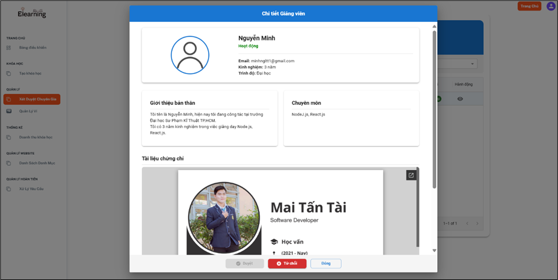

# eLearning Management System

## Overview

In the era of Industry 4.0, education is undergoing a significant transformation from traditional methods to online learning models. The integration of technology in teaching and management helps optimize educational activities, improves learning outcomes, and allows for flexible exploration and acquisition of new knowledge.

An advanced online learning management system (LMS) with a user-friendly interface and advanced features will assist schools and educational centers in managing students, courses, assessments, and creating a flexible, accessible learning environment for learners.

The digital learning model is no longer just an option; it has become an inevitable trend to drive innovation and meet the learning demands in a digital and globalized environment.

## Project Objectives

The goal of this project is to build a modern eLearning management system that meets the needs of the digital education environment. The system will allow:

- **Expert Registration and Management**: Experts can register accounts, authenticate their information, and become official members of the platform.
- **Course Creation and Management**: Experts can design, upload course content, and manage student registrations.
- **Student Management**: Students can register accounts, track their learning progress, and participate in courses they are enrolled in.
- **Learning Support Features**: Including assignments, feedback, reminders, and forums for interaction.
- **Personalized User Experience**: The system will have an intuitive, modern, and easy-to-use interface.
- **Optimization of Management and Reporting**: Provides data management tools and statistics reports to help experts and administrators monitor teaching and learning efficiency.

This project aims to create a comprehensive, easy-to-use online learning platform, contributing to improving the quality of education and optimizing teaching and learning activities in the context of Industry 4.0.

## Technologies Used:

- **Frontend**: Next.js, MUI (Material UI)
- **Backend**: Node.js, Express.js
- **Database**: Firebase Firestore

## Features

### User Interface

The system includes a user-friendly interface that allows both students and experts to interact with the platform efficiently.

### Registration Page

Users can easily register on the platform, providing necessary information for account creation and access.

### Course List Page

Users can view the list of available courses on the platform.

### Course Detail Page

Users can view detailed information about each course, including curriculum, objectives, and other details.

### Shopping Cart Page

Students can add courses to their shopping cart before making a purchase.

### Expert Chat Interface

Students can chat with experts for queries and guidance during their learning process.

### Purchase History Interface

Students can view their previous course purchases and track their learning progress.

### Student Learning Interface

Students can view their course lectures and learning materials within the platform.

### Expert Dashboard

Experts have access to a dashboard where they can manage their courses and interact with students.

### Course Creation Page

Experts can create and manage their own courses, offering content and setting course availability.

### Expert Wallet Interface

Experts can manage their earnings and payments within the platform.

### Expert Approval Function

Administrators can review and approve users applying to become experts.

### Refund Request Management

Admins and experts can manage refund requests from students.

### Refund Request Detail

Admins can view detailed information about refund requests to assess and process them.

## Future Features

The platform will continuously evolve and can be extended to include additional functionalities such as:

- **Online Exam Integration**: Conducting and grading online exams.
- **Course Recommendations**: A recommendation system for courses based on student preferences and learning behavior.
- **Automated Certification**: Issuance of certificates automatically upon course completion.
- **Mobile Application**: Extending the platform's usability to mobile devices for easy access on the go.

## Conclusion

The eLearning Management System aims to enhance the educational experience for both students and educators by integrating advanced technologies and offering a flexible, personalized, and secure learning environment. The system will support the digital transformation of education, making learning more accessible, interactive, and efficient for all users.
